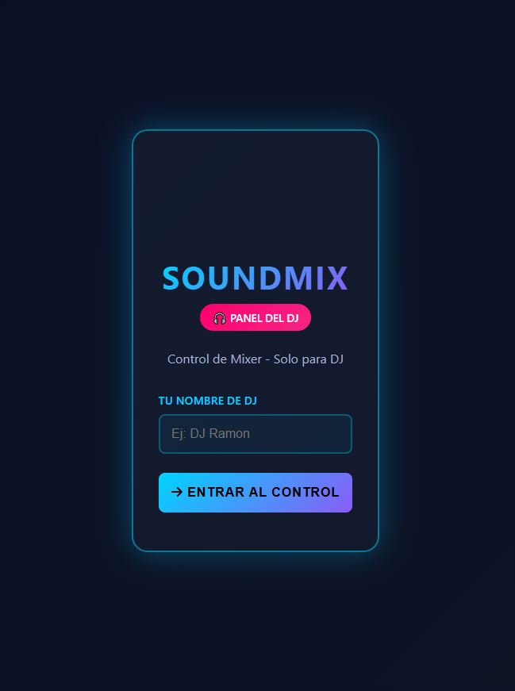
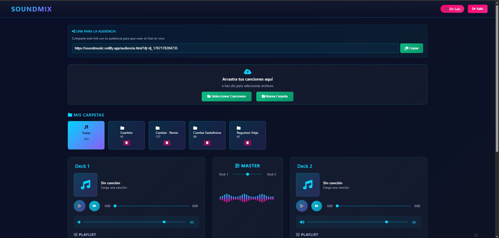
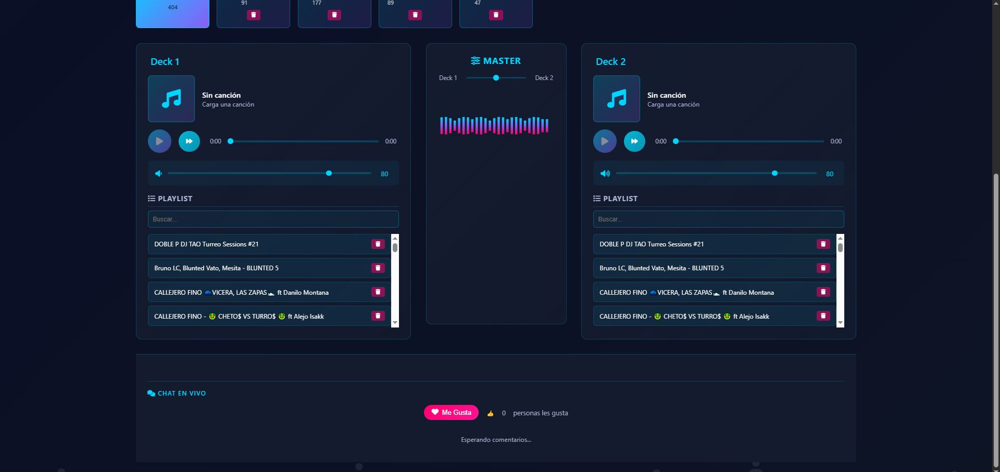
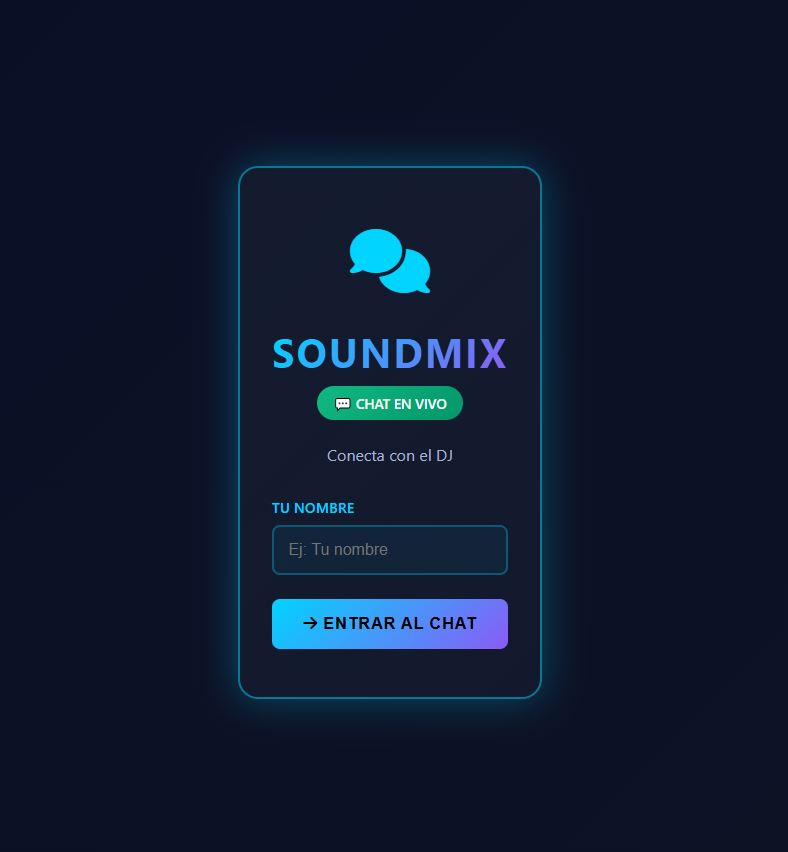

# 🎧 SoundMix DJ — Mixer en Tiempo Real

> Aplicación web de DJ con dos decks, crossfader, chat en vivo y sistema de likes — todo sincronizado en tiempo real vía Firebase.

[](https://soundmusiic.netlify.app/)
[](https://firebase.google.com/)
[](https://developer.mozilla.org/es/docs/Web/HTML)

---
## 📸 Screenshots






## 🚀 Demo

**👉 [soundmusiic.netlify.app](https://soundmusiic.netlify.app/)**

| Vista DJ | Vista Audiencia |
|---|---|
| Panel de control completo con 2 decks | Chat en tiempo real + likes |
| Abrí `index.html` | Abrí `audiencia.html?dj=[id]` |

---

## ✨ Funcionalidades

- 🎚️ **Dos decks independientes** con control de volumen individual
- 🎛️ **Crossfader** para transiciones suaves entre tracks
- 📁 **Carpetas por género** — Cuarteto, Cumbia, Reggaeton, Rock Nacional y más
- 💬 **Chat en tiempo real** — la audiencia comenta mientras el DJ mezcla
- ❤️ **Sistema de likes** sincronizado en vivo
- 🎵 **Siguiente automático** al terminar una canción
- 💾 **IndexedDB** para almacenamiento local de la biblioteca musical
- 🕺 **Fondo animado** con siluetas y visualizador de música
- 📱 **Responsive** — funciona en móvil y desktop

---

## 🛠️ Stack técnico

| Tecnología | Uso |
|---|---|
| **HTML5 / CSS3 / JS** | Frontend completo, sin frameworks |
| **Firebase Realtime DB** | Sincronización en tiempo real (chat + likes) |
| **IndexedDB** | Biblioteca de canciones local |
| **Web Audio API** | Reproducción y control de audio |
| **Font Awesome** | Íconos de la interfaz |

---

## 📁 Estructura del proyecto

```
soundmix/
├── index.html       # Panel del DJ — 2 decks, crossfader, carpetas
├── audiencia.html   # Vista de la audiencia — chat + likes
└── README.md
```

---

## ⚙️ Cómo usarlo localmente

### 1. Cloná el repo
```bash
git clone https://github.com/TU_USUARIO/soundmix-dj.git
cd soundmix-dj
```

### 2. Configurá Firebase
1. Creá un proyecto en [Firebase Console](https://console.firebase.google.com/)
2. Activá **Realtime Database**
3. Reemplazá el objeto `firebaseConfig` en `index.html` y `audiencia.html` con tus credenciales

> ⚠️ *Nota: la API key de Firebase web está diseñada para ser pública. La seguridad real se maneja desde las Security Rules del proyecto.*

### 3. Abrí en el browser
```
index.html      → Panel del DJ
audiencia.html  → Vista de la audiencia
```

> Para usarlo en red local o en producción, deployá ambos archivos en el mismo servidor (Netlify, GitHub Pages, etc.)

---

## 🌐 Deploy en Netlify

1. Descargá `index.html` y `audiencia.html`
2. Entrá a [netlify.com](https://netlify.com) → **Add new site → Deploy manually**
3. Arrastrá los dos archivos
4. ¡Listo! Netlify te da una URL pública

---

## 📖 Cómo fluye la app

```
DJ abre index.html
    └─> Se genera un ID de sesión único
    └─> Comparte el link: audiencia.html?dj=[ID]

Audiencia abre el link
    └─> Ve el chat en tiempo real
    └─> Puede comentar y dar likes

Firebase sincroniza todo instantáneamente
    └─> El DJ ve los comentarios y likes en su panel
```

---

## 👤 Autor

**Luis García** — [@LuisGarcia-InfoSec](https://www.linkedin.com/in/LuisGarcia-InfoSec)  
Analista de Ciberseguridad & Forense Digital · Buenos Aires, Argentina  
🌐 [proyects-luis.netlify.app](https://proyects-luis.netlify.app)

---

*Proyecto desarrollado para uso en eventos en vivo. Libre para usar y modificar.*
